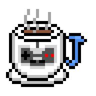

<p align="center">
  
</p>

# jemu

Multi-system emulator written in Java.


[](https://github.com/ArkoSammy12/jemu/actions/workflows/build.yml)

## Supported systems

| System                              | CLI identifier     | Status       |
|-------------------------------------|--------------------|--------------|
| CHIP-8                              | `chip8`            | ✅ Supported |
| STRICT CHIP-8                       | `strict-chip8`     | ✅ Supported |
| CHIP-8X                             | `chip8x`           | ✅ Supported |
| CHIP-48                             | `chip48`           | ✅ Supported |
| SUPER-CHIP 1.0                      | `schip10`          | ✅ Supported |
| SUPER-CHIP 1.1                      | `schip11`          | ✅ Supported |
| SUPER-CHIP MODERN                   | `schip-modern`     | ✅ Supported |
| XO-CHIP                             | `xochip`           | ✅ Supported |
| MEGA-CHIP                           | `megachip`         | ✅ Supported |
| HyperWaveCHIP-64                    | `hyperwave-chip64` | ✅ Supported |
| VIP CHIP-8                          | `vip-chip8`        | ✅ Supported |
| VIP CHIP-8X                         | `vip-chip8x`       | ✅ Supported |
| COSMAC VIP                          | `cosmac-vip`       | ✅ Supported |
| RCA Studio II                       | `rca-studioii`     | ✅ Supported |
| Game Boy (DMG)                      | `gameboy`          | ✅ Supported |
| Game Boy Color (CGB)                | `gameboy-color`    | ✅ Supported |
| Nintendo Entertainment System       | `nes`              | ✅ Supported |
| Atari 2600                          | `atari-2600`       | ✅ Supported |
| Commodore 64                        | `c64`              | 🚧 WIP       |
| Apple II                            | —                  | 🗓 Planned   |
| Space Invaders arcade cabinet       | —                  | 🗓 Planned   |
| Sega Master System                  | —                  | 🗓 Planned   |
| ZX Spectrum                         | —                  | 🗓 Planned   |
| Sega Genesis                        | —                  | 🗓 Planned   |
| Super Nintendo Entertainment System | —                  | 🗓 Planned   |

## Keybindings

### CHIP-8 / STRICT CHIP-8 / CHIP-8X / CHIP-48 / SUPER-CHIP 1.0 / SUPER-CHIP 1.1 / SUPER-CHIP MODERN / XO-CHIP / MEGA-CHIP / HyperWaveCHIP-64 / COSMAC VIP / VIP CHIP-8 / VIP CHIP-8X

| Keypad key | Keyboard key |
|------------|--------------|
| `1 2 3 C`  | `1 2 3 4`    |
| `4 5 6 D`  | `Q W E R`    |
| `7 8 9 E`  | `A S D F`    |
| `A 0 B F`  | `Z X C V`    |

### RCA Studio II

| Keypad A | Keyboard key |
|----------|--------------|
| `1 2 3`  | `1 2 3`      |
| `4 5 6`  | `Q W E`      |
| `7 8 9`  | `A S D`      |
| `- 0 -`  | `- X -`      |


| Keypad B | Numpad key | Keyboard key |
|----------|------------|--------------|
| `1 2 3`  | `7 8 9`    | `7 8 9`      |
| `4 5 6`  | `4 5 6`    | `U I O`      |
| `7 8 9`  | `1 2 3`    | `J K L`      |
| `- 0 -`  | `- 0 -`    | `- , -`      |

### Game Boy / Game Boy Color / Nintendo Entertainment System

| Action      | Key         |
|-------------|-------------|
| D-Pad Up    | `W`         |
| D-Pad Down  | `S`         |
| D-Pad Left  | `A`         |
| D-Pad Right | `D`         |
| A           | `J`         |
| B           | `K`         |
| Start       | `Enter`     |
| Select      | `Backspace` |

### Atari 2600

| Action               | Key |
|----------------------|-----|
| Game Select          | `E` |
| Game Reset           | `R` |
| Left Joystick Up     | `W` |
| Left Joystick Down   | `S` |
| Left Joystick Left   | `A` |
| Left Joystick Right  | `D` |
| Left Joystick Fire   | `F` |
| Right Joystick Up    | `I` |
| Right Joystick Down  | `K` |
| Right Joystick Left  | `J` |
| Right Joystick Right | `L` |
| Right Joystick Fire  | `;` |

## Command-line usage

If you launch **jemu** from the CLI, you can optionally pass arguments.

Usage:

```
jemu [-hV] -r=<romPath> [-s=<system>]
```

| Argument                    | Description                                                                                                                                                                                              | Default |
|-----------------------------|----------------------------------------------------------------------------------------------------------------------------------------------------------------------------------------------------------|---------|
| `-r, --rom <path>`          | Path to the ROM file.                                                                                                                                                                                    | —       |
| `-s, --system <identifier>` | Launch with the specified system selected, or omit to use the saved setting or system detected from ROM file extension, if specified. See [supported systems](#supported-systems) for valid identifiers. | —       |
| `-h, --help`                | Show the help message and exit.                                                                                                                                                                          | —       |
| `-V, --version`             | Print version information and exit.                                                                                                                                                                      | —       |

On startup **jemu** will attempt to perform a power-cycle with the provided, detected, or saved system and specified ROM file, if any.

## Dev Builds

The repository has a Github Actions workflow that runs on every push to the `dev` branch and contains native app image artifacts for Windows, MacOS and Linux, which will stay available for 90 days afterwards: https://github.com/ArkoSammy12/jemu/actions/workflows/dev-build.yml

These builds are not well tested and may have bugs.

## Building

A Java Development Kit targeting Java 25 or later is required to build this project.

This repository contains git submodules. When cloning, use the `--recurse-submodules` flag to ensure they are all downloaded correctly.

Once cloned, run the following from the top-level directory:

**Windows:**
```
.\mvnw clean package
```

**macOS/Linux:**
```
./mvnw clean package
```

An executable `.jar` file will be generated at `target/jemu-x.y.z.jar`.

To skip the automated unit tests, append `-DskipTests` to the build command.

## License

This project is licensed under the [MIT License](LICENSE).

## Special thanks

- [Steffen "gulrak" Schümann](https://github.com/gulrak): Significant help during my CHIP-8 emulation journey, serving as my primary guide and advisor. He has also generously lent me his STRICT-CHIP-8 implementation.
- [Mathew "theklap" Sutton](https://github.com/theklap): Significant accuracy improvements to the NES core.
- [dtabacaru](https://github.com/dtabacaru/): Providing audio filtering logic to system's audio processing units.
- [Shawn (L. Spiro) Wilcoxen](https://github.com/L-Spiro): Provide accurate audio filtering classes useful for quality NES APU output, and the amazing [Ricoh 2A03 instruction reference](https://github.com/L-Spiro/BeesNES/tree/main/Research/Instructions).
- [Andrew "ajoneil" O'Neil](https://github.com/ajoneil): Significant accuracy improvements to the DMG/CGB cores.
- [The Stella Team](https://stella-emu.github.io/theteam.html): Implementation of the Atari 2600's audio LFSR mechanism.